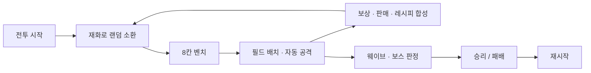

# Lucky Defense
### Project_DF · 운빨 디펜스 게임

**랜덤 소환 · 8칸 벤치 · 드래그 배치 · 레시피 합성 · 웨이브 전투**

Unity 6000.3.12f1 · C# · Addressables · UniTask · R3 · VContainer

[핵심 코드](#code-map) · [설계 포인트](#design) · [개발 방침](#development) · [검증 계획](#verification)

---

## 프로젝트 소개

랜덤으로 소환한 영웅을 배치하고, 재료 영웅과 아이템을 조합해 전력을 강화하며 웨이브를 방어하는 개인 개발 운빨 디펜스 게임입니다. 기획과 게임플레이 시스템 설계·구현을 담당합니다.

확률적인 소환 결과뿐 아니라 제한된 재화·인구수·배치 공간 안에서 영웅을 운영하는 흐름을 다룹니다. 반복 생성되는 유닛의 수명 관리와 비동기 소환·합성 중 상태가 어긋나지 않도록 하는 처리에 집중했습니다.

> **공개 범위**  
> 이 저장소는 private 개발 저장소의 게임플레이 스크립트를 공개 검토하기 위한 저장소입니다. **공개 대상 스크립트는 private 저장소와 동일하게 개발·반영하는 방침**이며, 프로젝트 전체의 에셋·씬·설정 또는 모든 커밋의 실시간 동기화를 의미하지 않습니다. 실행 빌드 파일은 제공하지 않습니다.

## 플레이 흐름

## 구현된 시스템

아래는 공개 코드에 포함된 구현 범위입니다. 자동화 테스트 통과나 배포 빌드의 실행 검증 결과를 뜻하지 않습니다.

| 시스템 | 주요 내용 |
| --- | --- |
| 랜덤 소환 | 등급·후보 가중치 추첨, 재화·인구수·벤치 공간 검사 |
| 배치·운영 | 8칸 벤치, 필드 드래그 배치, 선택·판매, 공격 대상 선택 |
| 레시피 합성 | 영웅·아이템 재료 검사와 예약, 결과 로드·배치, 실패·취소 시 복구 처리 |
| 웨이브 | 시간 기반 일반 웨이브, 제한 시간 내 보스 처치, 활성 적 수 제한에 따른 패배 |
| 전투 세션 | 시작·결과 화면, 승패 시 조작 중단, 재시작과 런타임 정리 |
| 데이터·UI | ScriptableObject 설정, R3 상태 구독, HUD·합성 View/Presenter 분리 |

## 핵심 코드 · Review Map

| 검토 영역 | 진입 파일 | 확인할 내용 |
| --- | --- | --- |
| 전투 세션 | [BattleGameController](Assets/@Scripts/Battle/BattleGameController.cs) | 서비스 조립·전투 종료·재시작 |
| 웨이브 | [WaveController](Assets/@Scripts/Battle/WaveController.cs) | UniTask 실행·취소, 보스 제한 시간, 상태 전환 |
| 랜덤 소환 | [HeroSummonService](Assets/@Scripts/Spawning/HeroSummonService.cs) | 추첨·조건 검사·로드 후 재검사·실패 복구 |
| 합성 | [HeroSynthesisService](Assets/@Scripts/Battle/HeroSynthesisService.cs) | 재료 예약 → 결과 로드 → 등록 교체 → 소비 |
| 풀링 | [EnemyPoolService](Assets/@Scripts/Pooling/EnemyPoolService.cs) / [HeroPoolService](Assets/@Scripts/Pooling/HeroPoolService.cs) | 반복 생성 유닛의 대여·반환 |
| 스폰·적 수 | [EnemySpawner](Assets/@Scripts/Spawning/EnemySpawner.cs) / [EnemyPopulationTracker](Assets/@Scripts/Battle/EnemyPopulationTracker.cs) | 스폰과 활성 수 추적의 책임 분리 |
| 배치 | [HeroDragController](Assets/@Scripts/Battle/HeroDragController.cs) / [HeroPlacementBoard](Assets/@Scripts/Battle/HeroPlacementBoard.cs) | 입력과 배치 상태 관리 |
| 의존성 조립 | [BattleRoundScope](Assets/@Scripts/BattleRoundScope.cs) | VContainer Scoped 등록과 생성자 주입 |
| 콘텐츠 데이터 | [SoData](Assets/@Scripts/SoData) | 웨이브·소환 확률·영웅·합성 레시피 |

## 설계 포인트

### 01. 비동기 소환과 상태 일관성

Addressables 로드 전후로 전투 상태와 배치 조건을 확인합니다. 소환에 실패하면 풀 반환과 비용 복구가 이루어지도록 처리하고, 소환·합성이 같은 등록 상태를 동시에 변경하지 않도록 잠금을 둡니다.

### 02. 재료를 먼저 잃지 않는 합성 흐름

재료를 예약한 뒤 결과 프리팹을 로드하고, 배치·인구수 등록을 확인한 후 재료를 소비합니다. 취소·실패 시 예약 해제와 원래 배치 복구를 시도하는 경로를 구현했습니다. 이 복구 경로는 향후 자동화 테스트의 우선 검증 대상입니다.

### 03. 데이터와 실행 책임 분리

웨이브·적·영웅·소환 테이블·합성 레시피는 ScriptableObject로 정의합니다. WaveController, 소환·합성 서비스는 MonoBehaviour가 아닌 C# 객체로 구성하지만, Unity 데이터·PlayerLoop·Actor에 대한 의존성은 남아 있습니다.

### 04. DI와 수명 관리

BattleRoundScope는 적 풀·스포너·활성 적 수 추적 서비스를 VContainer의 Scoped 수명으로 등록합니다. 다른 서비스는 BattleGameController에서 수동으로 조립하는 혼합 구조입니다. 현재 모든 서비스가 DI 컨테이너로 관리되는 것은 아니며, 재시작·종료 시 정리 책임을 더 명확하게 하는 것을 후속 개선 과제로 둡니다.

## 개발 방침 · Public / Private

- 주 개발과 고도화는 **private 저장소**에서 진행합니다.
- 공개 대상인 **스크립트 부분은 private 저장소와 동일한 구현을 유지·반영하는 방식**으로 개발합니다.
- 스크립트 일치 방침과 프로젝트 전체의 실행 환경 일치는 구분합니다. 에셋·씬·패키지 설정 차이로 공개본의 실행에 추가 설정이 필요할 수 있습니다.
- 자동 동기화 파이프라인 또는 양쪽 저장소의 현재 일치 검증을 완료했다는 의미는 아닙니다.
- private 저장소의 비공개 자료와 배포 권한이 없는 리소스는 공개 대상에 포함하지 않습니다.

### 향후 고도화 — 계획

- [ ] asmdef로 Runtime·Unity 연결부·Tests의 어셈블리 경계와 참조 방향 정리
- [ ] 재화·인구수·재료 집계 등 규칙의 Unity 의존성을 줄여 단위 테스트 구성
- [ ] 소환·합성 실패/취소, 풀 반환, 웨이브 종료를 검증하는 테스트 코드 작성
- [ ] DI Scope와 수동 Dispose의 소유권, 재시작 시 수명 경계 점검
- [ ] 공개 대상 스크립트의 차이를 확인하고 고도화 결과를 선별 반영

현재 공개 게임플레이 코드 영역에는 자체 asmdef·자동화 테스트 코드가 확인되지 않습니다. Unity Test Framework 패키지 포함과 테스트 작성·통과는 별개의 상태입니다.

## 우선 검증 시나리오 — 테스트 작성 예정

| 조건 | 확인할 결과 |
| --- | --- |
| 재화 부족·벤치 만석·인구수 초과 | 소환 거절 후 비용·풀·등록 상태 유지 |
| 소환/합성 로드 중 전투 종료 | 취소 후 신규 영웅·예약 재료가 남지 않는지 확인 |
| 합성 결과 로드 또는 배치 실패 | 재료·아이템·인구수·기존 위치 복구 |
| 일반 적 제한 도달 / 보스 시간 초과 | 올바른 패배 사유와 조작 중단 |
| 결과 화면에서 재시작 | 이전 비동기 작업·이벤트·유닛 등록이 다음 판에 남지 않는지 확인 |

개발용 등록 일치 검사도 HeroSummonService에 포함되어 있습니다. 이는 NUnit 기반 자동화 테스트나 성능 측정을 대신하지 않습니다.

## 프로젝트 열기

1. Unity Hub에서 저장소 루트를 추가하고 **Unity 6000.3.12f1**로 엽니다.
2. [Packages/manifest.json](Packages/manifest.json)의 패키지와 NuGet 의존성 복원 상태를 확인합니다.
3. [SampleScene](Assets/Scenes/SampleScene.unity)을 열어 씬 참조·ScriptableObject·Addressables 설정을 확인합니다.
4. 필요한 리소스와 설정을 연결한 후 Play Mode에서 위 시나리오를 검증합니다.

실행 빌드·실측 성능 수치·자동화 테스트 통과 결과는 현재 이 문서에서 제공하지 않습니다.
